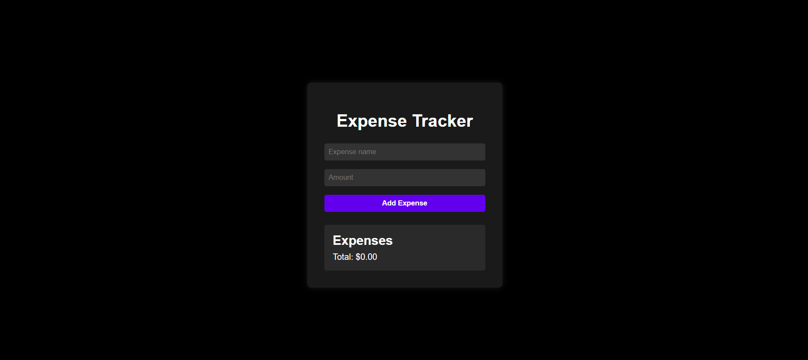
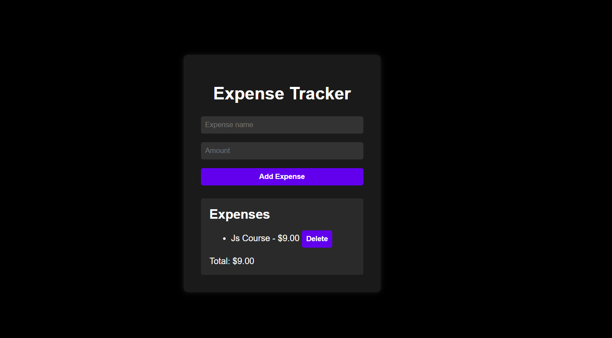

# Expense Tracker

This is a simple web-based **Expense Tracker** application that allows users to add and track their expenses. The application stores the expenses in the browser's local storage, so the data persists even after refreshing or closing the browser.

## Features

- Add new expenses with a name and amount.
- Displays a list of added expenses.
- View the total amount of all expenses.
- Delete expenses from the list.
- Expenses are saved in the browser's local storage for persistence.

## Technologies Used

- **HTML**: To structure the content of the application.
- **CSS**: For styling the user interface.
- **JavaScript**: To add interactivity, handle events, and manage expenses.
- **Local Storage**: To persist the expense data.

## Project Structure

```plaintext
├── index.html        # The main HTML file
├── style.css         # CSS file for styling
└── script.js         # JavaScript file for handling functionality
```

## Setup and Installation

1. **Clone the repository**:
   ```bash
   git clone https://github.com/yourusername/expense-tracker.git
   ```

2. **Open the project**:
   - Open the `index.html` file in your preferred browser.

No additional setup or dependencies are required.

## How to Use

### 1. Expense Tracker User Interface

This is the default user interface of the Expense Tracker where you can view the expenses and the total amount.

 <!-- Replace with your actual image path -->

### 2. Adding Expenses

Enter the expense name and amount in the respective input fields and click the "Add Expense" button to add the expense to the list.

 <!-- Replace with your actual image path -->


## Local Storage

The application uses the browser's local storage to save the expenses. This means:
- The expense data will persist between page reloads or browser sessions.
- To reset or clear expenses, delete them individually from the list, or clear the local storage manually from the browser's developer tools.

## Future Improvements

- Add the ability to edit expenses.
- Add filters to display expenses by categories.
- Implement expense graphs for better visualization of spending patterns.


