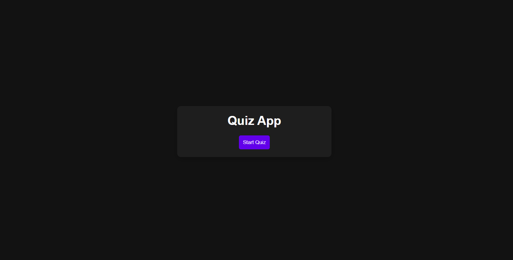
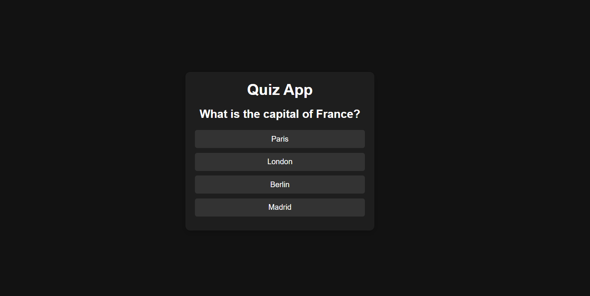

# Quiz App

A simple and interactive multiple-choice quiz application built using HTML, CSS, and JavaScript. This app allows users to answer a series of questions, tracks their score, and displays the final result at the end. Users can restart the quiz at any time to try again.

## Features
- **Start Quiz**: Click the "Start Quiz" button to begin answering questions.
- **Multiple Choice**: Each question offers multiple choices, where the user selects the correct answer.
- **Score Display**: The app calculates and displays the user's score once all questions are answered.
- **Restart Quiz**: Users can restart the quiz after completing it.
- **Modern Design**: Dark-themed interface with smooth transitions and hover effects.

## Screenshots

### Start Quiz

### Question Screen

## How to Use
1. Download or clone this repository.
2. Open the `index.html` file in your preferred web browser.
3. Click the "Start Quiz" button to begin the quiz.
4. Answer each question by clicking on the correct choice.
5. After answering all the questions, the app will display your score.
6. You can restart the quiz by clicking the "Restart Quiz" button.

## Installation
No installation required! Just download the project and open `index.html` in your browser.

## Project Structure
- **index.html**: Contains the structure of the quiz app.
- **style.css**: Defines the appearance and styling of the app.
- **script.js**: Contains all the logic for displaying questions, calculating scores, and managing user interaction.
- **images/**: This folder contains images for the README documentation.

## Technologies Used
- HTML
- CSS
- JavaScript

