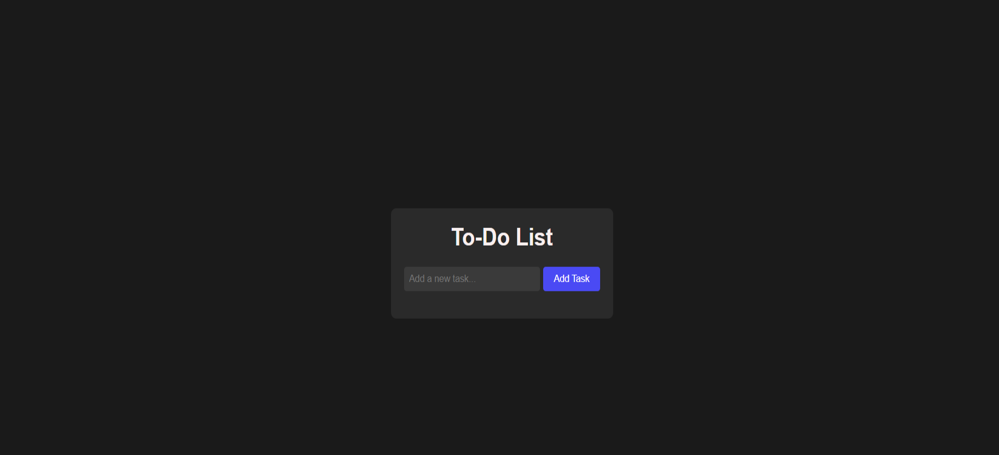
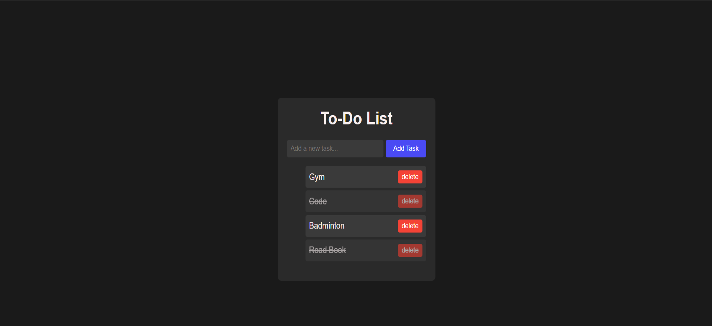
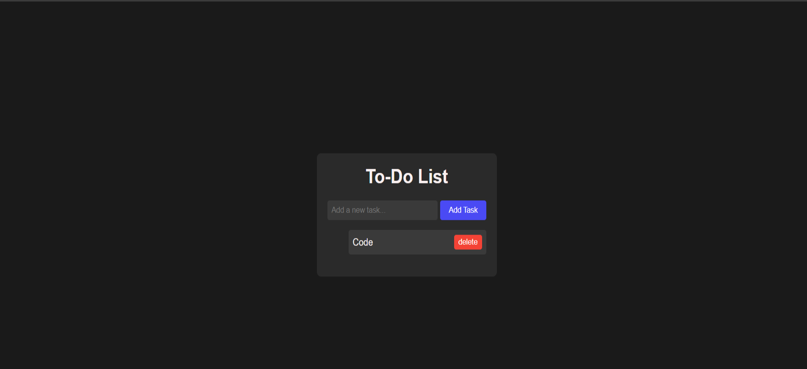

# To-Do List Application

This is a simple to-do list web application that allows users to add, mark tasks as completed, and delete tasks. The tasks are saved in the browser's `localStorage` so they persist even after a page refresh.

You can check out this project live [https://to-do-with-local-storage-2024.netlify.app/]

## Features
- Add new tasks
- Mark tasks as completed (strike-through)
- Delete tasks
- Tasks are saved in the browser's `localStorage` and persist across page reloads

## Installation and Setup

1. Clone the repository or download the files.
2. Ensure the following files are in the project directory:
3. Open the `index.html` file in any modern web browser to view the app.

## How to Use
- 

1. **Add a Task**: Enter the task description in the input field and click the "Add Task" button. The task will appear in the task list below.
   - 

2. **Mark Task as Completed**: Click on any task in the list to mark it as completed. Completed tasks will have a strike-through style.
   - 

3. **Delete a Task**: Click the "Delete" button next to any task to remove it from the list.
   - 

4. **Persistence**: Tasks are automatically saved in the browser's `localStorage`. You can refresh or close the browser, and the tasks will remain saved.

## Code Overview

- The `index.js` file manages the logic for adding, completing, and deleting tasks. Here's how it works:
    - **Adding a Task**: When the "Add Task" button is clicked, the task is added to an array of tasks, saved to `localStorage`, and rendered in the UI.
    - **Mark as Completed**: Clicking on a task toggles the `completed` state, which adds a strike-through to the task's text.
    - **Delete Task**: Clicking the "Delete" button removes the task from the array, the UI, and `localStorage`.

## Future Improvements
- Add editing functionality for tasks.
- Introduce categories or due dates for tasks.
- Implement drag-and-drop reordering of tasks.

## Conclusion

This basic to-do list app is an easy-to-use, lightweight project that showcases the use of vanilla JavaScript, `localStorage`, and basic DOM manipulation. It's a great starting point for more complex task management applications.

